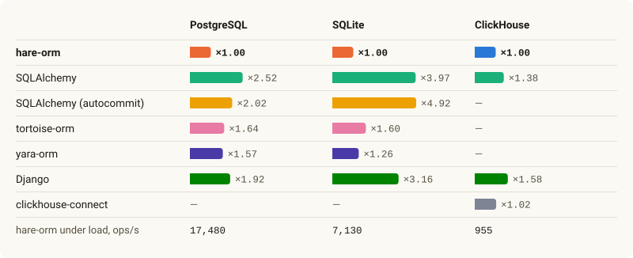

<h1 align="center">
  <picture>
    <source media="(prefers-color-scheme: dark)" srcset="docs/assets/readme-banner-dark.png">
    
  </picture>
</h1>

<p align="center"><a href="README.ru.md">Русский</a></p>

<p align="center">
  <a href="https://github.com/hare-orm/hare-orm/actions/workflows/ci.yml"></a>
  <a href="https://hare-orm.github.io/hare-orm/"></a>
  <a href="LICENSE"></a>
  <a href="pyproject.toml"></a>
</p>

An async Python ORM for PostgreSQL, SQLite and ClickHouse, built with relations in mind. Models are
plain classes, queries are built lazily through a `QuerySet`, and migrations are generated from the
changes to your models — close enough to Django's ORM that Django users feel at home, with the
async API, the speed and the database features a modern service needs. `hare-orm` began as a fork of
[Tortoise ORM](https://github.com/tortoise/tortoise-orm) and has been reworked throughout.

- **Fast.** A Rust PostgreSQL driver decodes rows and converts values outside Python, and every
  query shape is built once: a repeated query only binds its new values
  ([benchmarks](#benchmarks)).
- **Relations done right.** Composite primary keys everywhere — as foreign-key targets too — generic
  relations made of real foreign keys, `select_related()`/`prefetch_related()` with filters, recursive
  queries over a tree, and an error instead of a silently inflated aggregate.
- **Your schema, declared.** Constraints, partial and expression indexes, triggers, views,
  materialized views, functions, sequences, row level security policies, grants and partitioning
  live in the model's `Meta` and are created and changed by migrations.
- **Application patterns built in.** Soft delete, versioned rows, multi-tenancy (by column, by
  schema or by row level security), optimistic locking, dirty-field tracking and a transactional
  outbox are `Meta` options, not mixins to maintain.
- **Migrations you can trust.** Detected from your models, checked for operations that lock a busy
  table, compared with the live database (`hare drift`), and generated from an existing database
  (`hare inspectdb`).
- **Every database on its own terms.** SQLite, PostgreSQL and ClickHouse are dialects built on the
  public API a third-party package uses; PostgreSQL's types, indexes, PostGIS, pgvector, full-text
  search and `LISTEN`/`NOTIFY` come with it, and a database lacking a feature raises a clear error
  instead of returning a wrong result.
- **Ready for production.** Observers, OpenTelemetry, SQL comment tags, an N+1 detector, pool
  metrics, distributed transactions, read replicas and routers, PgBouncer support, Pydantic schemas
  and Litestar, FastAPI and Robyn integrations.
- **Checked before it runs.** A mypy plugin rejects a misspelled filter and types the rows of
  `values()`; a pytest plugin, factories and query-count assertions cover the tests.

## Contents

- [Quick start](#quick-start)
- [Models and relations](#models-and-relations)
- [Queries](#queries)
- [Behavior declared in `Meta`](#behavior-declared-in-meta)
- [The schema in `Meta`](#the-schema-in-meta)
- [Migrations](#migrations)
- [Transactions and connections](#transactions-and-connections)
- [Databases](#databases)
- [Web APIs and integrations](#web-apis-and-integrations)
- [Observability](#observability)
- [Testing and type checking](#testing-and-type-checking)
- [Installation](#installation)
- [Benchmarks](#benchmarks)
- [Documentation](#documentation)

## Quick start

```bash
pip install hare-orm
```

```python
# library/models.py
from hare import fields
from hare.models import Model


class Author(Model):
    id = fields.IntField(primary_key=True)
    name = fields.CharField(max_length=120)


class Book(Model):
    id = fields.IntField(primary_key=True)
    author = fields.ForeignKeyField("models.Author", related_name="books")
    title = fields.CharField(max_length=300)
    rating = fields.IntField(default=0)
```

```python
# main.py
import asyncio

from hare import Hare, HareConfig
from library.models import Author, Book


async def main() -> None:
    await Hare.init(HareConfig.from_db_url("sqlite+aiosqlite://db.sqlite3", {"models": ["library.models"]}))
    await Hare.generate_schemas()

    author = await Author.objects.create(name="Ursula K. Le Guin")
    await Book.objects.create(author=author, title="The Left Hand of Darkness", rating=5)

    async for book in Book.objects.filter(author__name__icontains="le guin").select_related("author"):
        print(book.title, "—", book.author.name)

    await Hare.close_connections()


asyncio.run(main())
```

A real project keeps its schema in migrations instead of `generate_schemas()`:
`hare makemigrations`, then `hare migrate`. See
[Your first model](https://hare-orm.github.io/hare-orm/getting-started/first-model/).

## Models and relations

```python
from hare import fields
from hare.ddl import RawSQLTerm
from hare.models import Model


class Author(Model):
    id = fields.IntField(primary_key=True)
    name = fields.CharField(max_length=120)


class Shelf(Model):
    store = fields.CharField(max_length=20)
    number = fields.IntField()
    pk = fields.CompositePrimaryKey("store", "number")      # a composite primary key


class Tag(Model):
    id = fields.IntField(primary_key=True)
    name = fields.CharField(max_length=50, unique=True)


class Book(Model):
    id = fields.IntField(primary_key=True)
    isbn = fields.CharField(max_length=13, unique=True)
    title = fields.CharField(max_length=300)
    author = fields.ForeignKeyField("models.Author", related_name="books")
    shelf = fields.ForeignKeyField("models.Shelf", related_name="books", null=True)  # both key columns
    tags = fields.ManyToManyField("models.Tag", related_name="books")
    rating = fields.IntField(default=0)
    published_at = fields.DateField(null=True)
    price = fields.DecimalField(max_digits=10, decimal_places=2)
    quantity = fields.IntField(default=0)
    stock_value = fields.GeneratedField(                     # computed by the database
        RawSQLTerm("price * quantity"), output_field=fields.DecimalField(max_digits=12, decimal_places=2)
    )
    supplier_token = fields.EncryptedTextField(null=True)   # encrypted at rest, hidden in logs


class Category(Model):
    id = fields.IntField(primary_key=True)
    name = fields.CharField(max_length=100)
    parent = fields.ForeignKeyField("models.Category", related_name="children", null=True)


class Comment(Model):
    id = fields.IntField(primary_key=True)
    target = fields.GenericForeignKeyField({"book": Book, "shelf": Shelf}, related_name="comments")
    text = fields.TextField()
```

- **Composite primary keys** work everywhere a single-column key does: as a foreign-key target with
  a real table-level `FOREIGN KEY`, in joins, cascades, `prefetch_related()`, `__in` filters and
  cursors. A table may also have [no primary key at all](https://hare-orm.github.io/hare-orm/models/meta-options/#primary_key).
- **`GenericForeignKeyField`** is an exclusive arc of real foreign keys — a column, a foreign key and
  an index per target, with a `CHECK` that exactly one is set — so the database keeps it consistent.
- Every `on_delete` — `CASCADE`, `RESTRICT`, `PROTECT`, `SET_NULL`, `SET_DEFAULT` — also runs for
  the rows a `QuerySet.delete()` removes, and `delete_preview()` shows what deleting a row would reach.
- Fields cover JSON (with path lookups), enums, decimals, UUIDs, binary data, aware datetimes, arrays,
  ranges, geometry and vectors; [custom fields](https://hare-orm.github.io/hare-orm/extending/custom-fields/)
  plug into the same machinery.

## Queries

```python
from hare import Transactions
from hare.query.expressions import Case, Exists, F, OuterReference, Q, Subquery, Value, When, Window
from hare.query.functions import Avg, Count, Sum
from hare.query.functions.window import Lag, Rank

# Filters across relations, Q objects and F expressions
await Book.objects.filter(Q(title__icontains="dark") | Q(rating__gte=4), shelf__store="north")
await Book.objects.filter(quantity=0).update(quantity=F("quantity") + 10, rating=F("rating") - 1)

# Aggregates, grouped by what you select
await Author.objects.annotate(book_count=Count("books"), avg_rating=Avg("books__rating")).filter(book_count__gte=3)
await Book.objects.values("author__name").annotate(total=Sum("quantity")).order_by("-total")

# Subqueries, Exists and conditional expressions
latest = Book.objects.filter(author=OuterReference("pk")).order_by("-published_at").values("title")[:1]
await Author.objects.annotate(
    latest_title=Subquery(latest),
    has_bestseller=Exists(Book.objects.filter(author=OuterReference("pk"), rating=5)),
)
await Book.objects.annotate(level=Case(When(rating__gte=4, then=Value("good")), default=Value("other")))

# Window functions
await Book.objects.annotate(
    rank_in_author=Window(Rank(), partition_by=["author_id"], order_by=["-rating"]),
    previous_price=Window(Lag("price"), partition_by=["author_id"], order_by=["published_at"]),
)

# A category and every descendant, in one WITH RECURSIVE query
await Category.objects.filter(pk=root.pk).with_recursive("children", max_depth=5)

# Relations loaded with the rows, keyset pagination, a locked row
await Book.objects.select_related("author").prefetch_related("tags")
newest = Book.objects.order_by("-published_at", "id")
next_page = await newest.after_cursor(*newest.cursor_values(last_book)).limit(20)
async with Transactions.atomic():
    book = await Book.objects.select_for_update(skip_locked=True).get(id=book_id)

# Upsert in one statement
await Book.objects.bulk_create(books, on_conflict=["isbn"], update_fields=["price", "quantity"])
```

- **Typed rows.** `values()` and `values_list()` return dicts and tuples, with paths through relations,
  JSON keys and date parts (`"published_at__year"`).
- **Safe aggregates.** An aggregate next to a to-many join that would count a row twice raises
  `QueryError` instead of returning an inflated number; grouping sets and subtotals are supported.
- **Set operations** (`union()`, `intersection()`, `difference()`), `FilteredRelation`, `Lateral`,
  `JsonTable`, CTEs (`with_cte()`), `distinct(<fields>)`, random sampling and `iterator()`/`stream()`
  over large results.
- **[The query plan cache](https://hare-orm.github.io/hare-orm/querying/query-plan-cache/)** keeps
  the SQL of every query shape: the second `filter(title__icontains=...)` with another value skips
  building the query and only binds the value.
- **[Raw SQL](https://hare-orm.github.io/hare-orm/querying/raw-sql/)** when you need it:
  `RawSQL(...)` inside a query, `raw()` returning model instances, `execute_sql()`.

## Behavior declared in `Meta`

```python
from hare.contrib.outbox import ChangeCapture, OutboxEvent
from hare.contrib.versioning import VersionedModel
from hare.models.tenancy.tenancy import Tenancy


class OrderEvent(OutboxEvent):                  # the outbox table, relayed to Kafka, RabbitMQ, Redis...
    pass


class Order(Model):
    id = fields.IntField(primary_key=True)
    company_id = fields.IntField(db_index=True)
    status = fields.CharField(max_length=20)
    version = fields.IntField(default=1)
    deleted_at = fields.DatetimeField(null=True)

    class Meta:
        tenant_field = "company_id"          # every query scoped to the active tenant
        soft_delete_field = "deleted_at"     # delete() marks the row; queries hide it
        optimistic_lock_field = "version"    # save() of a stale copy raises StaleObjectError
        track_dirty_fields = True            # get_dirty_fields(); save() writes only the changes
        change_capture = ChangeCapture(OrderEvent)  # every write also lands in the outbox


with Tenancy.scope(company.id):
    pending = await Order.objects.filter(status="pending")   # WHERE company_id = ... AND deleted_at IS NULL
    await pending[0].delete()                                # soft delete
    restored = await Order.objects.only_deleted().get(id=order_id)
    await restored.restore()


class Document(VersionedModel):                # a new row per version, (id, version) as the key
    title = fields.CharField(max_length=200)


current = await Document.get_last_version_or_exception(id=document_id)
draft = await current.create_new_version(title="Second draft")
```

- **[Multi-tenancy](https://hare-orm.github.io/hare-orm/soft-delete-versions-tenants/multi-tenancy/)**
  by a column, by a [schema per tenant](https://hare-orm.github.io/hare-orm/soft-delete-versions-tenants/schema-per-tenant/),
  or enforced by the database itself through row level security — the scope also reaches joined
  models and fills the tenant of a new row.
- **[Soft delete](https://hare-orm.github.io/hare-orm/soft-delete-versions-tenants/soft-delete/)**
  cascades to the related rows that soft-delete too, and `restore()` brings them back.
- **[The transactional outbox](https://hare-orm.github.io/hare-orm/integrations/outbox/)** writes an
  event in the transaction of the change it reports and delivers it at least once, in order per row,
  to Kafka, RabbitMQ, Redis, a webhook or taskiq.

## The schema in `Meta`

```python
from hare.ddl import (
    CheckConstraint, DatabaseFunction, MaterializedView, PartialIndex, Policy, RawSQLTerm,
    RowLevelSecurity, TenantCondition, Trigger, TriggerEvent, TriggerTiming, UniqueConstraint, View,
)
from hare.dialects.postgresql.indexes import GinIndex
from hare.query.expressions import Q


class Invoice(Model):
    id = fields.IntField(primary_key=True)
    tenant_id = fields.IntField()
    number = fields.CharField(max_length=20)
    amount = fields.DecimalField(max_digits=12, decimal_places=2)
    status = fields.CharField(max_length=10)
    tags = fields.JSONField(default=list)

    class Meta:
        tenant_field = "tenant_id"
        constraints = (
            CheckConstraint(name="invoice_amount_positive", check=Q(amount__gt=0)),
            UniqueConstraint(fields=("tenant_id", "number"), condition=Q(status="open")),
        )
        indexes = (PartialIndex(fields=("tenant_id",), condition=Q(status="open")), GinIndex(fields=("tags",)))
        triggers = (
            Trigger(
                name="invoice_no_negative",
                on=TriggerEvent.UPDATE,
                timing=TriggerTiming.BEFORE,
                when=Q(amount__lt=0),
                body=RawSQLTerm("RAISE EXCEPTION 'negative amount'; RETURN NEW;"),
            ),
        )
        views = [View("open_invoices", query=lambda: Invoice.objects.all_tenants().filter(status="open").values("id"))]
        materialized_views = [
            MaterializedView(
                "invoice_totals",
                query=RawSQLTerm("SELECT tenant_id, sum(amount) AS total FROM invoice GROUP BY tenant_id"),
                unique_columns=("tenant_id",),
            )
        ]
        functions = [
            DatabaseFunction(
                "current_tenant",
                returns="integer",
                body=RawSQLTerm("SELECT current_setting('app.tenant')::integer"),
                language="sql",
            )
        ]
        row_level_security = RowLevelSecurity.FORCED
        policies = [Policy(name="invoice_tenant", using=TenantCondition())]
```

Every object here is created by `migrate`, changed when its declaration changes and dropped when it
is removed; `hare drift` reports the tables, columns, indexes, constraints and triggers the database
no longer matches the models in. Conditions are `Q` objects over the model's own fields, so a renamed
field is renamed inside them too; raw SQL is always an explicit `RawSQLTerm(...)`. PostgreSQL tables can also be
[partitioned](https://hare-orm.github.io/hare-orm/models/meta-options/#table_options) by hash, list or
range, with `ExclusionConstraint`, deferrable constraints, sequences and grants alongside.

## Migrations

```bash
hare makemigrations          # detect the changes to your models
hare migrate                 # apply them
hare checkmigrations         # flag operations that would lock or rewrite a large table
hare drift shop              # compare the models of an app with the live database
hare inspectdb > models.py   # generate models from an existing database
hare squashmigrations shop 0010
```

```text
WARNING: risky on a database in use if the tables are large - `hare checkmigrations` checks against the database:
  app.0007_remove_book_pages: Remove field pages from Book [remove_field]
    The column of Book.pages is dropped while the code still running reads it.
    Safely: First remove the field from the models only - SeparateDatabaseAndState(state_operations=[RemoveField(model_name='Book', name='pages')]) - and drop the column with RunSQL in a later migration, once no running code reads it.
```

- **[Zero-downtime rules](https://hare-orm.github.io/hare-orm/migrations/zero-downtime/)** know which
  operations rewrite a table, take a long lock or break the code still running, and say how to do
  each one safely — `AddIndex(..., concurrently=True)`, `AddConstraint(..., not_valid=True)` with
  `ValidateConstraint`, `BackfillColumn` in batches and `AlterColumnNotNullSafe` are built in.
- Renames, data migrations (`RunPython`, `RunSQL`), merges of forked histories, migrations across
  apps and connections,
  [migrations without files](https://hare-orm.github.io/hare-orm/migrations/migrations-without-files/)
  for runtime-registered models, and a `hare` command with `shell`, `dbshell`, `sqlmigrate` and
  `stubs`.

## Transactions and connections

```python
from hare import Transactions

async with Transactions.atomic(lock_timeout=2.0):
    await order.save()
    Transactions.on_commit(lambda: notify_warehouse(order.id))      # runs once the transaction commits

async for attempt in Transactions.atomic(isolation="serializable", retries=3):
    async with attempt:                                             # run again after a serialization failure
        await transfer(source, destination, amount)

async with Transactions.autonomous() as connection:                     # commits even if the caller rolls back
    await AuditLog.objects.using(connection).create(action="attempt")

async with Transactions.distributed(coordinator="orders", participants=["billing"]) as transactions:
    await Order.objects.using(transactions.coordinator).create(...)      # two-phase commit
    await Payment.objects.using(transactions["billing"]).create(...)

book = await Book.objects.using("replica").get(id=book_id)              # its relations read from "replica" too
```

Savepoints nest, `statement_timeout`/`lock_timeout`/`read_only` apply per transaction, a
[router](https://hare-orm.github.io/hare-orm/connections/multiple-databases/) sends reads and writes
to their databases, and [PgBouncer](https://hare-orm.github.io/hare-orm/connections/connection-poolers/)
1.21+ keeps prepared statements working behind it.

## Databases

| | SQLite | PostgreSQL | ClickHouse |
|---|---|---|---|
| Driver | `aiosqlite` | Rust driver (default) or `asyncpg` | `clickhouse-connect` (HTTP) or `clickhouse-driver` (native TCP) |
| Transactions | ✓ | ✓ | with `transactions=true` on a server with ClickHouse Keeper |
| Foreign keys and `on_delete` | ✓ | ✓ | checked and run by hare |
| `UPDATE` in place | ✓ | ✓ | a mutation finished before the call returns, or a lightweight `UPDATE` |
| Full-text search (`__search`, `SearchRank`, `SearchHeadline`) | FTS5 | `tsvector` | — |
| Vector search (`VectorField`, `CosineDistance`) | sqlite-vec | pgvector | — |
| Geometry (`PointField`, `__dwithin`, `__contains`) | SpatiaLite | PostGIS | ClickHouse's geo types |

```python
from hare import Connections
from hare.dialects.postgresql.functions import TrigramSimilarity
from hare.search import SearchQuery, SearchRank, SearchType
from hare.vectors import CosineDistance

await Article.objects.filter(body__search=SearchQuery("hare orm", search_type=SearchType.PHRASE))
await Article.objects.annotate(rank=SearchRank(("title", "body"), "hare orm")).order_by("-rank")
await Item.objects.annotate(distance=CosineDistance("embedding", query_vector)).order_by("distance")[:10]
await Author.objects.annotate(score=TrigramSimilarity("name", "Gerard")).filter(score__gt=0.3)

listener = await Connections.get("default").listen("orders", on_notify)   # PostgreSQL LISTEN/NOTIFY
```

PostgreSQL adds `ArrayField`, range and multirange fields, `HStoreField`, `CitextField`,
[PostGIS](https://hare-orm.github.io/hare-orm/dialects/search-and-geodata/gis/), trigram and
`unaccent` lookups, and the GIN, GiST, BRIN, Bloom, Hash, SP-GiST, IVFFlat and HNSW indexes.
[ClickHouse](https://hare-orm.github.io/hare-orm/dialects/clickhouse/connecting/) tables declare their
engine, sort key, partitioning, TTL, projections and distribution over a cluster; ClickHouse adds
arrays, maps, tuples and `Variant`/`Dynamic` fields, `final()`, `prewhere()`, `limit_by()` and
`with_totals()`, its own aggregates, materialized views and dictionaries, and row locks in ClickHouse
Keeper. Another database is a
[dialect package](https://hare-orm.github.io/hare-orm/extending/writing-a-dialect/) away.

## Web APIs and integrations

```python
from pydantic import BaseModel, ConfigDict

from hare.contrib.frameworks import PageSchema
from hare.contrib.frameworks.fastapi import HareFastAPI, RequestQueryDependency
from hare.contrib.request_query import OffsetPagination, OrderingConfig, Page, RequestQuery, SearchConfig


class BookSchema(BaseModel):
    model_config = ConfigDict(from_attributes=True)

    id: int
    title: str


class BookQuery(RequestQuery[Book]):        # ?author=3&search=dark&ordering=-published_at&limit=20
    author: int | None = None
    title__icontains: str | None = None

    class Meta:
        queryset = Book.objects.all().select_related("author")
        search = SearchConfig(fields=("title", "author__name"))
        ordering = OrderingConfig(fields=("title", "published_at"), default=("-published_at",))
        pagination = OffsetPagination(default_limit=50, max_limit=200)


app = HareFastAPI(hare_config=HARE_CONFIG, atomic_requests=True)   # every request in a transaction


@app.get("/books", response_model=PageSchema[BookSchema])
async def list_books(books: BookQuery = RequestQueryDependency.provide(BookQuery)) -> Page[Book]:
    return await books.page()
```

[Request queries](https://hare-orm.github.io/hare-orm/integrations/request-queries/) turn the
parameters of an HTTP request into a validated, filtered, searched, ordered and paginated query.
[Litestar](https://hare-orm.github.io/hare-orm/integrations/litestar/),
[FastAPI](https://hare-orm.github.io/hare-orm/integrations/fastapi/) and
[Robyn](https://hare-orm.github.io/hare-orm/integrations/robyn/) integrations open the ORM with the
app, can run every request in a transaction and turn ORM errors into HTTP statuses;
[Pydantic](https://hare-orm.github.io/hare-orm/integrations/pydantic/) schemas are generated from the
models, and [taskiq](https://hare-orm.github.io/hare-orm/integrations/taskiq/) workers run every task
in the tenant scope of the code that sent it, with its queries tagged by the task, and a task is sent
only once the transaction asking for it commits.

## Observability

```python
from hare.contrib.opentelemetry import OpenTelemetryInstrumentor
from hare.contrib.repeated_queries import RepeatedQueryDetector
from hare.instrumentation import Observers, QueryExecuted, QueryTags

OpenTelemetryInstrumentor().instrument()                     # a span per query, pool metrics
Observers.observe(QueryExecuted, lambda event: metrics.observe(event.duration_ms))

async with RepeatedQueryDetector(threshold=10, window_seconds=1.0):  # warns about N+1 patterns as they happen
    with QueryTags.scope(job="sync_orders"):                 # ... /*job='sync_orders'*/ on every query
        await sync_orders()
```

Observers also see changed rows and transaction events; a slow-query log, pool health checks and
metrics complete the picture. See [Observability](https://hare-orm.github.io/hare-orm/observability/observers/).

## Testing and type checking

```python
from hare.contrib.factories import ModelFactory, Sequence, SubFactory


class AuthorFactory(ModelFactory[Author]):
    name = Sequence(lambda number: f"Author {number}")


class BookFactory(ModelFactory[Book]):
    isbn = Sequence(lambda number: f"{number:013d}")
    title = Sequence(lambda number: f"Book {number}")
    price = 10
    author = SubFactory(AuthorFactory)


async def test_list_books(hare_db, hare_assert_query_count):     # fixtures of the bundled pytest plugin
    await BookFactory.create_batch(3)
    async with hare_assert_query_count(1):
        await Book.objects.select_related("author")
```

```python
Book.objects.filter(titel="War")
# error: Unknown filter param 'titel': Book has no field 'titel'  [hare-query]

rows = await Book.objects.values("id", "title", "author__name")
reveal_type(rows[0])   # TypedDict({'id': int, 'title': str, 'author__name': str})
```

The pytest plugin creates the test databases, isolates every test in a rolled-back transaction and
runs a test only where the database has the features it needs; the
[mypy plugin and pyright stubs](https://hare-orm.github.io/hare-orm/querying/type-checking/) check
filters, orderings and `values()` against the models.

## Installation

```bash
pip install hare-orm

pip install hare-orm[asyncpg]        # the pure-Python PostgreSQL driver, instead of the Rust one
pip install hare-orm[clickhouse]     # the ClickHouse dialect over HTTP (clickhouse-connect)
pip install hare-orm[clickhouse-driver]  # the ClickHouse dialect over the native TCP protocol (clickhouse-driver)
pip install hare-orm[sqlite-vec]     # vector search on SQLite
pip install hare-orm[encryption]     # EncryptedTextField / EncryptedJSONField (Fernet)
pip install hare-orm[fastapi]        # also: litestar, robyn, request-query, taskiq
pip install hare-orm[kafka]          # outbox delivery; also: rabbitmq, redis, http
pip install hare-orm[opentelemetry]  # an OpenTelemetry span around every query
pip install hare-orm[pytest]         # the pytest plugin; also: mypy, pyright
pip install hare-orm[ipython]        # `hare shell` with IPython
```

Every extra is listed under
[Installation](https://hare-orm.github.io/hare-orm/getting-started/installation/). Requires Python
3.12, 3.13 or 3.14.

## Benchmarks

<!-- benchmarks:start -->
hare-orm against SQLAlchemy, tortoise-orm, yara-orm, Django and clickhouse-connect on PostgreSQL,
SQLite and ClickHouse, on the same scenarios: how many times slower than hare-orm each ORM is on
each database, on average, and hare-orm's operations per second under load, measured warm — a
running application, not one just started:

<p align="center">
  <picture>
    <source media="(prefers-color-scheme: dark)" srcset="docs/assets/benchmarks/scoreboard-en-dark.svg">
    
  </picture>
</p>

Every scenario, the machine and the versions are on the
[Benchmarks](https://hare-orm.github.io/hare-orm/benchmarks/) pages; the benchmark itself is
[`benchmarks/bench.py`](benchmarks/README.md).
<!-- benchmarks:end -->

## Documentation

**[hare-orm.github.io/hare-orm](https://hare-orm.github.io/hare-orm/)** — the full
reference: every field type, `Meta` option, `QuerySet` method, migration operation, transaction
primitive, dialect feature, PostgreSQL type and index, and the exception hierarchy, in English and
Russian. If you're new to hare-orm, start with
[Getting Started](https://hare-orm.github.io/hare-orm/getting-started/installation/).

To build and browse it locally instead (e.g. to preview an unreleased change):

```bash
poetry install
poetry run mkdocs serve
```

## Versioning and releases

hare-orm follows [Semantic Versioning](https://semver.org/). Its public API is what the
[documentation](https://hare-orm.github.io/hare-orm/) describes; undocumented names and names
with a leading underscore are internal and may change in any release.

Before 1.0.0 the API is still settling:

- a **patch** release (`0.9.1`) only fixes bugs;
- a **minor** release (`0.10.0`) adds features and may change or remove public API. Every such
  change is listed under *Breaking changes* in that release's [CHANGELOG](CHANGELOG.md) entry. A
  renamed or removed name is gone in that same release — hare-orm doesn't keep deprecated aliases.

From 1.0.0 on, breaking changes land only in a major release. Pin the minor version you tested
against (`hare-orm>=0.9,<0.10`) and read the changelog before moving to the next one.

Each release is tagged `vX.Y.Z`, published to [PyPI](https://pypi.org/project/hare-orm/) and to
[GitHub Releases](https://github.com/hare-orm/hare-orm/releases), and described in
[CHANGELOG.md](CHANGELOG.md). Work in progress lives on the `dev` branch; `main` points at the
latest release.

### Supported versions

| Component | Supported |
| --- | --- |
| hare-orm | The latest minor release; fixes ship as its patch releases |
| Python | CPython 3.12, 3.13, 3.14 |
| SQLite | 3.35.5+ |
| PostgreSQL | 14+ |
| ClickHouse | 24.3+ |

Dropping a Python or database version is a breaking change and is announced in the changelog.
Security fixes follow [SECURITY.md](SECURITY.md).

## Contributing

Bug reports, feature proposals and pull requests are welcome. [CONTRIBUTING.md](CONTRIBUTING.md)
covers the dev environment, the test matrix (SQLite, the columnar test dialect, PostgreSQL via
`asyncpg` and via the Rust driver, PgBouncer, ClickHouse), code style, how a change gets reviewed and
merged, and the sign-off every commit needs.

## License

MIT — see [LICENSE](LICENSE). `hare-orm` began as a fork of Tortoise ORM and vendors an adapted
copy of PyPika's query-builder internals; both are Apache License 2.0. The Rust PostgreSQL driver
was inspired by the one in [yara-orm](https://github.com/vsdudakov/yara-orm), an open-source ORM
under the MIT License, and adapts parts of its code. The required notices of all three live in
[NOTICE.md](NOTICE.md).
