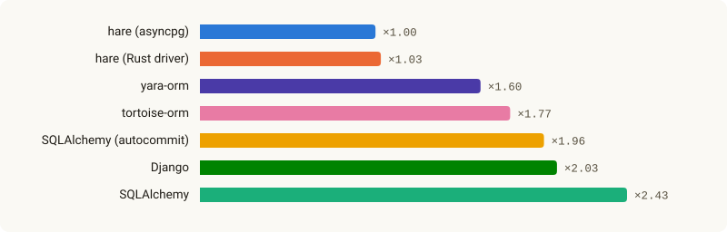
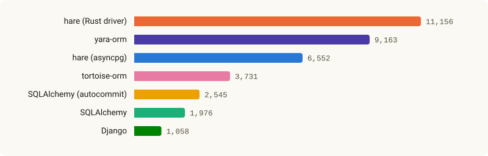

<h1 align="center">
  <picture>
    <source media="(prefers-color-scheme: dark)" srcset="docs/assets/readme-banner-dark.png">
    
  </picture>
</h1>

<p align="center"><a href="README.ru.md">Русский</a></p>

<p align="center">
  <a href="https://github.com/hare-orm/hare-orm/actions/workflows/ci.yml"></a>
  <a href="https://hare-orm.github.io/hare-orm/"></a>
  <a href="LICENSE"></a>
  <a href="pyproject.toml"></a>
</p>

An async Python ORM for PostgreSQL and SQLite, built with relations in mind. `hare-orm` is a heavily
reworked fork of [Tortoise ORM](https://github.com/tortoise/tortoise-orm), close enough to Django's
ORM in shape that Django users will feel at home — models are plain classes, queries are built
lazily through a `QuerySet`, and migrations are generated by diffing model state.

What sets it apart:

- **Pluggable dialects.** SQLite and PostgreSQL are dialects built on the same public API a
  third-party package uses (the `hare.dialects` package and its entry point): SQL, column types,
  DDL, introspection and the features of each server version come from the dialect, not from
  checks scattered through the ORM. A database without transactions, foreign keys or unique
  constraints gets explicit errors instead of silently wrong results, and models may have no
  primary key. See [Writing a dialect](https://hare-orm.github.io/hare-orm/extending/writing-a-dialect/).
- **A Rust PostgreSQL driver** (`hare.dialects.postgresql.drivers.rust_pg`) is the default for
  `postgresql://` URLs, decoding rows and converting values in Rust rather than pure Python — with
  the pure-Python `asyncpg` driver (`postgresql+asyncpg://`) available instead.
- **Composite primary keys are supported on an equal footing with single-column ones** — including as
  foreign-key targets, with real table-level `FOREIGN KEY` constraints, cascades, joins and
  `prefetch_related()` support.
- **Optimistic locking, soft delete, versioning, multi-tenancy and dirty-field tracking are native
  `Meta` options**, not hand-rolled mixins your application has to maintain.
- **Declarative DB triggers and constraints** (`Meta.triggers`, `Meta.constraints`, including
  PostgreSQL `EXCLUDE`/`CONSTRAINT TRIGGER`) are actually applied when a migration runs — not just
  written into migration state for tracking.
- **PostgreSQL's own types and indexes** live in its dialect package (`hare.dialects.postgresql`) —
  `ArrayField`, range fields, `HStoreField`, `PostGISField`, `TSVectorField` and full-text search,
  `VectorField` (pgvector), trigram lookups, and the GIN/GiST/BRIN/Bloom/Hash/SP-GiST/IVFFlat/HNSW
  index family.
- **A Django-style migration system and CLI** (`hare makemigrations`/`migrate`/`inspectdb`/...) —
  migrations are detected from changes to your models, not written by hand.
- **Request queries and web framework integrations.** `hare.contrib.request_query` turns the
  parameters of an HTTP request into a validated, paginated query; the Litestar, FastAPI and Robyn
  integrations open the Hare context, can run each request in a transaction, and turn ORM errors
  into the right HTTP status.
- **Observability built in** — query hooks, slow-query logging, a repeated-query (N+1) detector
  and OpenTelemetry spans.

## Quick example

```python
from hare import fields
from hare.models import Model


class Author(Model):
    id = fields.UUIDField(primary_key=True)
    name = fields.CharField(max_length=120)
    email = fields.CharField(max_length=254, unique=True, null=True)

    class Meta:
        table_description = "Book authors"


async def main() -> None:
    author = await Author.objects.create(name="Ursula K. Le Guin")
    async for a in Author.objects.filter(name__icontains="le guin"):
        print(a.name)
```

## Installation

```bash
pip install hare-orm

pip install hare-orm[asyncpg]        # the pure-Python PostgreSQL driver, instead of the Rust one
pip install hare-orm[ipython]        # `hare shell` with IPython
pip install hare-orm[encryption]     # EncryptedTextField / EncryptedJSONField (Fernet)
pip install hare-orm[opentelemetry]  # an OpenTelemetry span around every query
pip install hare-orm[tzlocal]        # naming the machine's own time zone (use_tz=False)
pip install hare-orm[request-query]  # hare.contrib.request_query
pip install hare-orm[litestar]       # hare.contrib.frameworks.litestar
pip install hare-orm[fastapi]        # hare.contrib.frameworks.fastapi
pip install hare-orm[robyn]          # hare.contrib.frameworks.robyn
```

Requires Python 3.14+.

## Benchmarks

<!-- benchmarks:start -->
hare-orm against SQLAlchemy, tortoise-orm, yara-orm and Django on the same 32 scenarios, against one
PostgreSQL server: how many times slower than hare-orm on asyncpg (its faster driver in this run)
each ORM is on average, and how many operations per second 50 workers get through on one connection
pool:

<p align="center">
  <picture>
    <source media="(prefers-color-scheme: dark)" srcset="docs/assets/benchmarks/summary-slower-en-dark.svg">
    
  </picture>
</p>
<p align="center">
  <picture>
    <source media="(prefers-color-scheme: dark)" srcset="docs/assets/benchmarks/summary-load-en-dark.svg">
    
  </picture>
</p>

Every scenario, the machine and the versions are on the
[Benchmarks](https://hare-orm.github.io/hare-orm/benchmarks/) page; the benchmark itself is
[`benchmarks/bench.py`](benchmarks/README.md).
<!-- benchmarks:end -->

## Documentation

**[hare-orm.github.io/hare-orm](https://hare-orm.github.io/hare-orm/)** — the full
reference: every field type, `Meta` option, `QuerySet` method, migration operation, transaction
primitive, dialect feature, PostgreSQL type and index, and the exception hierarchy, in English and
Russian. If you're new to hare-orm, start with
[Getting Started](https://hare-orm.github.io/hare-orm/getting-started/installation/).

To build and browse it locally instead (e.g. to preview an unreleased change):

```bash
poetry install
poetry run mkdocs serve
```

## Versioning and releases

hare-orm follows [Semantic Versioning](https://semver.org/). Its public API is what the
[documentation](https://hare-orm.github.io/hare-orm/) describes; undocumented names and names
with a leading underscore are internal and may change in any release.

Before 1.0.0 the API is still settling:

- a **patch** release (`0.9.1`) only fixes bugs;
- a **minor** release (`0.10.0`) adds features and may change or remove public API. Every such
  change is listed under *Breaking changes* in that release's [CHANGELOG](CHANGELOG.md) entry. A
  renamed or removed name is gone in that same release — hare-orm doesn't keep deprecated aliases.

From 1.0.0 on, breaking changes land only in a major release. Pin the minor version you tested
against (`hare-orm>=0.9,<0.10`) and read the changelog before moving to the next one.

Each release is tagged `vX.Y.Z`, published to [PyPI](https://pypi.org/project/hare-orm/) and to
[GitHub Releases](https://github.com/hare-orm/hare-orm/releases), and described in
[CHANGELOG.md](CHANGELOG.md). Work in progress lives on the `dev` branch; `main` points at the
latest release.

### Supported versions

| Component | Supported |
| --- | --- |
| hare-orm | The latest minor release; fixes ship as its patch releases |
| Python | CPython 3.14+ |
| SQLite | 3.35.0+ |
| PostgreSQL | 14+ |

Dropping a Python or database version is a breaking change and is announced in the changelog.
Security fixes follow [SECURITY.md](SECURITY.md).

## Contributing

Bug reports, feature proposals and pull requests are welcome. [CONTRIBUTING.md](CONTRIBUTING.md)
covers the dev environment, the test matrix (SQLite, the columnar test dialect, PostgreSQL via
`asyncpg` and via the Rust driver), code style, how a change gets reviewed and merged, and the
sign-off every commit needs.

## License

MIT — see [LICENSE](LICENSE). `hare-orm` began as a fork of Tortoise ORM and vendors an adapted
copy of PyPika's query-builder internals; both are Apache License 2.0. The Rust PostgreSQL driver
was inspired by the one in [yara-orm](https://github.com/vsdudakov/yara-orm), an open-source ORM
under the MIT License, and adapts parts of its code. The required notices of all three live in
[NOTICE.md](NOTICE.md).
