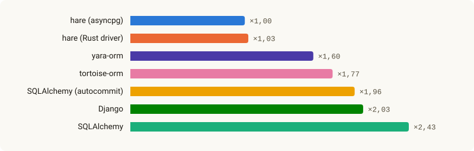
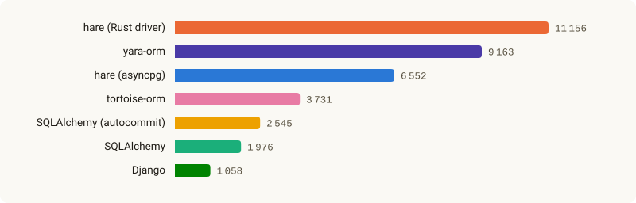

<h1 align="center">
  <picture>
    <source media="(prefers-color-scheme: dark)" srcset="docs/assets/readme-banner-dark.png">
    
  </picture>
</h1>

<p align="center"><a href="README.md">English</a></p>

<p align="center">
  <a href="https://github.com/hare-orm/hare-orm/actions/workflows/ci.yml"></a>
  <a href="https://hare-orm.github.io/hare-orm/ru/"></a>
  <a href="LICENSE"></a>
  <a href="pyproject.toml"></a>
</p>

Асинхронная ORM для Python с PostgreSQL и SQLite, спроектированная с упором на связи между
моделями. `hare-orm` — глубоко переработанный форк [Tortoise ORM](https://github.com/tortoise/tortoise-orm),
по устройству близкий к ORM Django, так что пользователи Django почувствуют себя как дома: модели —
обычные классы, запросы строятся лениво через `QuerySet`, а миграции создаются сравнением состояния
моделей.

Чем она отличается:

- **Подключаемые диалекты.** SQLite и PostgreSQL — диалекты на том же публичном API, которым
  пользуется сторонний пакет (пакет `hare.dialects` и одноимённая точка входа): SQL, типы колонок, DDL,
  чтение схемы базы и возможности каждой версии сервера берутся из диалекта, а не из проверок,
  разбросанных по ORM. База без транзакций, внешних ключей или уникальных ограничений получает явные
  ошибки вместо молча неверных результатов, а модели могут обходиться без первичного ключа. См.
  [Как написать диалект](https://hare-orm.github.io/hare-orm/ru/extending/writing-a-dialect/).
- **Драйвер PostgreSQL на Rust** (`hare.dialects.postgresql.drivers.rust_pg`) используется по
  умолчанию для адресов `postgresql://`: строки разбираются и значения преобразуются на Rust, а не
  на чистом Python. Вместо него можно взять драйвер `asyncpg` на чистом Python
  (`postgresql+asyncpg://`).
- **Составные первичные ключи поддерживаются наравне с обычными** — в том числе как цель внешнего
  ключа, с настоящими ограничениями `FOREIGN KEY` на уровне таблицы, каскадами, соединениями и
  `prefetch_related()`.
- **Оптимистическая блокировка, мягкое удаление, версии, разделение данных по арендаторам и
  отслеживание изменённых полей — встроенные опции `Meta`**, а не самодельные примеси, которые
  приходится поддерживать в приложении.
- **Объявляемые в модели триггеры и ограничения** (`Meta.triggers`, `Meta.constraints`, включая
  `EXCLUDE`/`CONSTRAINT TRIGGER` в PostgreSQL) действительно применяются при выполнении миграции, а
  не только записываются в состояние миграций.
- **Собственные типы и индексы PostgreSQL** лежат в пакете его диалекта (`hare.dialects.postgresql`):
  `ArrayField`, поля диапазонов, `HStoreField`, `PostGISField`, `TSVectorField` и полнотекстовый
  поиск, `VectorField` (pgvector), операторы фильтра по триграммам и индексы
  GIN/GiST/BRIN/Bloom/Hash/SP-GiST/IVFFlat/HNSW.
- **Система миграций и командная строка в духе Django** (`hare makemigrations`/`migrate`/`inspectdb`/...):
  миграции строятся по изменениям в моделях, вручную их писать не нужно.
- **Запросы из HTTP-параметров и интеграции с веб-фреймворками.** `hare.contrib.request_query`
  превращает параметры HTTP-запроса в проверенный запрос к базе с разбиением на страницы;
  интеграции с Litestar, FastAPI и Robyn открывают контекст Hare, могут выполнять каждый
  HTTP-запрос в транзакции и превращают ошибки ORM в нужный HTTP-код.
- **Встроенное наблюдение за запросами** — обработчики запросов, журнал медленных запросов,
  обнаружение повторяющихся запросов (N+1) и спаны OpenTelemetry.

## Короткий пример

```python
from hare import fields
from hare.models import Model


class Author(Model):
    id = fields.UUIDField(primary_key=True)
    name = fields.CharField(max_length=120)
    email = fields.CharField(max_length=254, unique=True, null=True)

    class Meta:
        table_description = "Book authors"


async def main() -> None:
    author = await Author.objects.create(name="Ursula K. Le Guin")
    async for a in Author.objects.filter(name__icontains="le guin"):
        print(a.name)
```

## Установка

```bash
pip install hare-orm

pip install hare-orm[asyncpg]        # драйвер PostgreSQL на чистом Python вместо драйвера на Rust
pip install hare-orm[ipython]        # `hare shell` с IPython
pip install hare-orm[encryption]     # EncryptedTextField / EncryptedJSONField (Fernet)
pip install hare-orm[opentelemetry]  # спан OpenTelemetry вокруг каждого запроса
pip install hare-orm[tzlocal]        # определение часового пояса машины (use_tz=False)
pip install hare-orm[request-query]  # hare.contrib.request_query
pip install hare-orm[litestar]       # hare.contrib.frameworks.litestar
pip install hare-orm[fastapi]        # hare.contrib.frameworks.fastapi
pip install hare-orm[robyn]          # hare.contrib.frameworks.robyn
```

Нужен Python 3.14 или новее.

## Производительность

<!-- benchmarks:start -->
hare-orm против SQLAlchemy, tortoise-orm, yara-orm и Django на одних и тех же сценариях (всего 32) с
одним сервером PostgreSQL. Во сколько раз каждая ORM в среднем медленнее, чем hare-orm на драйвере
asyncpg (более быстром драйвере hare-orm в этом прогоне), и сколько операций в секунду выполняют 50
задач на одном пуле подключений:

<p align="center">
  <picture>
    <source media="(prefers-color-scheme: dark)" srcset="docs/assets/benchmarks/summary-slower-ru-dark.svg">
    
  </picture>
</p>
<p align="center">
  <picture>
    <source media="(prefers-color-scheme: dark)" srcset="docs/assets/benchmarks/summary-load-ru-dark.svg">
    
  </picture>
</p>

Все сценарии, машина и версии — на странице
[Производительность](https://hare-orm.github.io/hare-orm/ru/benchmarks/) документации; сам стенд —
[`benchmarks/bench.py`](benchmarks/README.ru.md).
<!-- benchmarks:end -->

## Документация

**[hare-orm.github.io/hare-orm/ru](https://hare-orm.github.io/hare-orm/ru/)** — полный справочник:
каждый тип поля, опция `Meta`, метод `QuerySet`, операция миграции, средство работы с
транзакциями, возможность диалекта, тип и индекс PostgreSQL и иерархия исключений, на русском и
английском. Если вы впервые знакомитесь с hare-orm,
начните с раздела [Начало работы](https://hare-orm.github.io/hare-orm/ru/getting-started/installation/).

Чтобы собрать и посмотреть её у себя (например, чтобы увидеть ещё не выпущенное изменение):

```bash
poetry install
poetry run mkdocs serve
```

## Версии и выпуски

Номера версий hare-orm следуют [семантическому версионированию](https://semver.org/lang/ru/).
Публичный API — это то, что описано в [документации](https://hare-orm.github.io/hare-orm/ru/);
неописанные имена и имена с ведущим подчёркиванием внутренние и могут измениться в любом выпуске.

До версии 1.0.0 API ещё не устоялся:

- **патч-выпуск** (`0.9.1`) только исправляет ошибки;
- **минорный выпуск** (`0.10.0`) добавляет возможности и может изменить или убрать часть публичного
  API. Каждое такое изменение перечислено в разделе *Breaking changes* записи этого выпуска в
  [CHANGELOG](CHANGELOG.ru.md). Переименованное или убранное имя исчезает в том же выпуске —
  hare-orm не оставляет устаревших псевдонимов.

Начиная с 1.0.0 несовместимые изменения появляются только в мажорных выпусках. Закрепите минорную
версию, с которой вы проверяли своё приложение (`hare-orm>=0.9,<0.10`), и прочитайте журнал
изменений перед переходом на следующую.

Каждый выпуск помечается тегом `vX.Y.Z`, публикуется на [PyPI](https://pypi.org/project/hare-orm/)
и в [GitHub Releases](https://github.com/hare-orm/hare-orm/releases) и описывается в
[CHANGELOG.ru.md](CHANGELOG.ru.md). Текущая работа идёт в ветке `dev`; `main` указывает на последний
выпуск.

### Поддерживаемые версии

| Компонент | Поддерживается |
| --- | --- |
| hare-orm | Последний минорный выпуск; исправления выходят его патч-выпусками |
| Python | CPython 3.14+ |
| SQLite | 3.35.0+ |
| PostgreSQL | 14+ |

Отказ от поддержки версии Python или базы данных — несовместимое изменение, о нём объявляется в
журнале изменений. Исправления уязвимостей выпускаются по правилам [SECURITY.md](SECURITY.ru.md).

## Участие в разработке

Сообщения об ошибках, предложения и пул-реквесты приветствуются. В [CONTRIBUTING](CONTRIBUTING.ru.md)
описаны окружение разработки, набор тестов (SQLite, тестовый колоночный диалект, PostgreSQL через
`asyncpg` и через драйвер на Rust), стиль кода, как изменение проверяется и принимается и подпись
(sign-off), которая нужна каждому коммиту.

## Лицензия

MIT — см. [LICENSE](LICENSE). `hare-orm` начиналась как форк Tortoise ORM и содержит
переработанную копию внутреннего построителя запросов PyPika; оба проекта распространяются по
лицензии Apache 2.0. Драйвер PostgreSQL на Rust создан по образцу драйвера
[yara-orm](https://github.com/vsdudakov/yara-orm) — открытой ORM под лицензией MIT — и использует
переработанные части его кода. Обязательные уведомления об авторстве всех трёх проектов собраны в
[NOTICE](NOTICE.ru.md).
