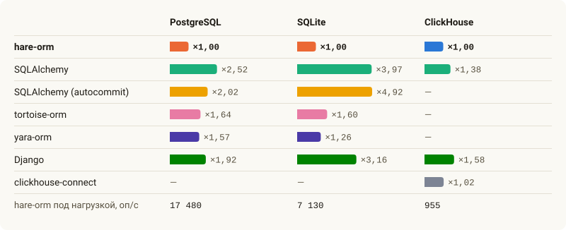

<h1 align="center">
  <picture>
    <source media="(prefers-color-scheme: dark)" srcset="docs/assets/readme-banner-dark.png">
    
  </picture>
</h1>

<p align="center"><a href="README.md">English</a></p>

<p align="center">
  <a href="https://github.com/hare-orm/hare-orm/actions/workflows/ci.yml"></a>
  <a href="https://hare-orm.github.io/hare-orm/ru/"></a>
  <a href="LICENSE"></a>
  <a href="pyproject.toml"></a>
</p>

Асинхронная ORM для Python с PostgreSQL, SQLite и ClickHouse, спроектированная с упором на связи между
моделями. Модели — обычные классы, запросы строятся лениво через `QuerySet`, а миграции создаются по
изменениям моделей. По устройству она близка к ORM Django, так что пользователи Django почувствуют
себя как дома, — но с асинхронным API, скоростью и возможностями баз данных, которые нужны
современному сервису. `hare-orm` начиналась как форк [Tortoise ORM](https://github.com/tortoise/tortoise-orm)
и переработана целиком.

- **Быстрая.** Драйвер PostgreSQL на Rust разбирает строки и преобразует значения вне Python, а
  каждая форма запроса строится один раз: повторный запрос только подставляет новые значения
  ([производительность](#производительность)).
- **Связи как надо.** Составные первичные ключи везде — и как цель внешнего ключа, обобщённые связи
  из настоящих внешних ключей, `select_related()`/`prefetch_related()` с условиями, рекурсивные
  запросы по дереву и ошибка вместо незаметно завышенного агрегата.
- **Схема — в объявлениях.** Ограничения, частичные индексы и индексы по выражениям, триггеры,
  представления, материализованные представления, функции, последовательности, политики защиты
  строк, права и секционирование описываются в `Meta` модели, а создают и меняют их миграции.
- **Готовые прикладные приёмы.** Мягкое удаление, версии строк, мультитенантность (по колонке, по
  схеме или защитой строк в самой базе), оптимистичная блокировка, отслеживание изменённых полей и
  transactional outbox — опции `Meta`, а не примеси, которые приходится поддерживать самим.
- **Миграциям можно доверять.** Они выводятся из моделей, проверяются на операции, блокирующие
  нагруженную таблицу, сравниваются с живой базой (`hare drift`) и создаются по существующей базе
  (`hare inspectdb`).
- **Каждая база — на своих условиях.** SQLite, PostgreSQL и ClickHouse — диалекты на том же
  публичном API, которым пользуется сторонний пакет; с PostgreSQL приходят его типы, индексы,
  PostGIS, pgvector, полнотекстовый поиск и `LISTEN`/`NOTIFY`, а база без нужной возможности
  отвечает понятной ошибкой вместо неверного результата.
- **Готова к продакшену.** Наблюдатели, OpenTelemetry, теги в комментариях SQL, детектор N+1,
  метрики пула, распределённые транзакции, реплики для чтения и маршрутизаторы, поддержка PgBouncer,
  схемы Pydantic и интеграции с Litestar, FastAPI и Robyn.
- **Проверяется до запуска.** Плагин mypy отклоняет опечатку в фильтре и выводит типы строк
  `values()`; плагин pytest, фабрики и проверки числа запросов покрывают тесты.

## Содержание

- [Быстрый старт](#быстрый-старт)
- [Модели и связи](#модели-и-связи)
- [Запросы](#запросы)
- [Поведение в `Meta`](#поведение-в-meta)
- [Схема в `Meta`](#схема-в-meta)
- [Миграции](#миграции)
- [Транзакции и подключения](#транзакции-и-подключения)
- [Базы данных](#базы-данных)
- [Веб-API и интеграции](#веб-api-и-интеграции)
- [Наблюдаемость](#наблюдаемость)
- [Тесты и проверка типов](#тесты-и-проверка-типов)
- [Установка](#установка)
- [Производительность](#производительность)
- [Документация](#документация)

## Быстрый старт

```bash
pip install hare-orm
```

```python
# library/models.py
from hare import fields
from hare.models import Model


class Author(Model):
    id = fields.IntField(primary_key=True)
    name = fields.CharField(max_length=120)


class Book(Model):
    id = fields.IntField(primary_key=True)
    author = fields.ForeignKeyField("models.Author", related_name="books")
    title = fields.CharField(max_length=300)
    rating = fields.IntField(default=0)
```

```python
# main.py
import asyncio

from hare import Hare, HareConfig
from library.models import Author, Book


async def main() -> None:
    await Hare.init(HareConfig.from_db_url("sqlite+aiosqlite://db.sqlite3", {"models": ["library.models"]}))
    await Hare.generate_schemas()

    author = await Author.objects.create(name="Ursula K. Le Guin")
    await Book.objects.create(author=author, title="The Left Hand of Darkness", rating=5)

    async for book in Book.objects.filter(author__name__icontains="le guin").select_related("author"):
        print(book.title, "—", book.author.name)

    await Hare.close_connections()


asyncio.run(main())
```

В настоящем проекте схема ведётся миграциями, а не `generate_schemas()`: `hare makemigrations`, затем
`hare migrate`. См. [Первая модель](https://hare-orm.github.io/hare-orm/ru/getting-started/first-model/).

## Модели и связи

```python
from hare import fields
from hare.ddl import RawSQLTerm
from hare.models import Model


class Author(Model):
    id = fields.IntField(primary_key=True)
    name = fields.CharField(max_length=120)


class Shelf(Model):
    store = fields.CharField(max_length=20)
    number = fields.IntField()
    pk = fields.CompositePrimaryKey("store", "number")      # составной первичный ключ


class Tag(Model):
    id = fields.IntField(primary_key=True)
    name = fields.CharField(max_length=50, unique=True)


class Book(Model):
    id = fields.IntField(primary_key=True)
    isbn = fields.CharField(max_length=13, unique=True)
    title = fields.CharField(max_length=300)
    author = fields.ForeignKeyField("models.Author", related_name="books")
    shelf = fields.ForeignKeyField("models.Shelf", related_name="books", null=True)  # обе колонки ключа
    tags = fields.ManyToManyField("models.Tag", related_name="books")
    rating = fields.IntField(default=0)
    published_at = fields.DateField(null=True)
    price = fields.DecimalField(max_digits=10, decimal_places=2)
    quantity = fields.IntField(default=0)
    stock_value = fields.GeneratedField(                     # вычисляет база
        RawSQLTerm("price * quantity"), output_field=fields.DecimalField(max_digits=12, decimal_places=2)
    )
    supplier_token = fields.EncryptedTextField(null=True)   # шифруется в базе, скрыто в логах


class Category(Model):
    id = fields.IntField(primary_key=True)
    name = fields.CharField(max_length=100)
    parent = fields.ForeignKeyField("models.Category", related_name="children", null=True)


class Comment(Model):
    id = fields.IntField(primary_key=True)
    target = fields.GenericForeignKeyField({"book": Book, "shelf": Shelf}, related_name="comments")
    text = fields.TextField()
```

- **Составные первичные ключи** работают везде, где работает ключ из одной колонки: как цель
  внешнего ключа с настоящим табличным `FOREIGN KEY`, в соединениях, каскадах, `prefetch_related()`,
  фильтрах `__in` и курсорах. Таблица может быть и [вовсе без первичного ключа](https://hare-orm.github.io/hare-orm/ru/models/meta-options/#primary_key).
- **`GenericForeignKeyField`** — исключающая дуга из настоящих внешних ключей: на каждую цель колонка,
  внешний ключ и индекс, а `CHECK` следит, чтобы был задан ровно один, — так что согласованность
  держит сама база.
- Каждое `on_delete` — `CASCADE`, `RESTRICT`, `PROTECT`, `SET_NULL`, `SET_DEFAULT` — выполняется и
  для строк, которые удаляет `QuerySet.delete()`, а `delete_preview()` показывает, до чего дойдёт
  удаление строки.
- Есть поля для JSON (с поиском по путям), перечислений, десятичных чисел, UUID, двоичных данных,
  дат и времени с часовым поясом, массивов, диапазонов, геометрии и векторов;
  [свои поля](https://hare-orm.github.io/hare-orm/ru/extending/custom-fields/) подключаются к тому же
  механизму.

## Запросы

```python
from hare import Transactions
from hare.query.expressions import Case, Exists, F, OuterReference, Q, Subquery, Value, When, Window
from hare.query.functions import Avg, Count, Sum
from hare.query.functions.window import Lag, Rank

# Фильтры через связи, объекты Q и выражения F
await Book.objects.filter(Q(title__icontains="dark") | Q(rating__gte=4), shelf__store="north")
await Book.objects.filter(quantity=0).update(quantity=F("quantity") + 10, rating=F("rating") - 1)

# Агрегаты с группировкой по выбранному
await Author.objects.annotate(book_count=Count("books"), avg_rating=Avg("books__rating")).filter(book_count__gte=3)
await Book.objects.values("author__name").annotate(total=Sum("quantity")).order_by("-total")

# Подзапросы, Exists и условные выражения
latest = Book.objects.filter(author=OuterReference("pk")).order_by("-published_at").values("title")[:1]
await Author.objects.annotate(
    latest_title=Subquery(latest),
    has_bestseller=Exists(Book.objects.filter(author=OuterReference("pk"), rating=5)),
)
await Book.objects.annotate(level=Case(When(rating__gte=4, then=Value("good")), default=Value("other")))

# Оконные функции
await Book.objects.annotate(
    rank_in_author=Window(Rank(), partition_by=["author_id"], order_by=["-rating"]),
    previous_price=Window(Lag("price"), partition_by=["author_id"], order_by=["published_at"]),
)

# Категория и все её потомки одним запросом WITH RECURSIVE
await Category.objects.filter(pk=root.pk).with_recursive("children", max_depth=5)

# Связи, загруженные вместе со строками, постраничный вывод по ключу, заблокированная строка
await Book.objects.select_related("author").prefetch_related("tags")
newest = Book.objects.order_by("-published_at", "id")
next_page = await newest.after_cursor(*newest.cursor_values(last_book)).limit(20)
async with Transactions.atomic():
    book = await Book.objects.select_for_update(skip_locked=True).get(id=book_id)

# Вставка с обновлением при конфликте одной командой
await Book.objects.bulk_create(books, on_conflict=["isbn"], update_fields=["price", "quantity"])
```

- **Типизированные строки.** `values()` и `values_list()` возвращают словари и кортежи, с путями
  через связи, ключи JSON и части даты (`"published_at__year"`).
- **Безопасные агрегаты.** Агрегат рядом с соединением по связи «ко многим», который посчитал бы
  строку дважды, даёт `QueryError` вместо завышенного числа; есть наборы группировок и подытоги.
- **Операции над множествами** (`union()`, `intersection()`, `difference()`), `FilteredRelation`,
  `Lateral`, `JsonTable`, CTE (`with_cte()`), `distinct(<fields>)`, случайная выборка и
  `iterator()`/`stream()` для больших результатов.
- **[Кэш планов запросов](https://hare-orm.github.io/hare-orm/ru/querying/query-plan-cache/)** хранит
  SQL каждой формы запроса: второй `filter(title__icontains=...)` с другим значением не строит запрос
  заново, а только подставляет значение.
- **[Готовый SQL](https://hare-orm.github.io/hare-orm/ru/querying/raw-sql/)**, когда он нужен:
  `RawSQL(...)` внутри запроса, `raw()` с экземплярами моделей, `execute_sql()`.

## Поведение в `Meta`

```python
from hare.contrib.outbox import ChangeCapture, OutboxEvent
from hare.contrib.versioning import VersionedModel
from hare.models.tenancy.tenancy import Tenancy


class OrderEvent(OutboxEvent):                  # таблица outbox; события уходят в Kafka, RabbitMQ, Redis...
    pass


class Order(Model):
    id = fields.IntField(primary_key=True)
    company_id = fields.IntField(db_index=True)
    status = fields.CharField(max_length=20)
    version = fields.IntField(default=1)
    deleted_at = fields.DatetimeField(null=True)

    class Meta:
        tenant_field = "company_id"          # каждый запрос — в пределах активного тенанта
        soft_delete_field = "deleted_at"     # delete() помечает строку; запросы её скрывают
        optimistic_lock_field = "version"    # save() устаревшей копии даёт StaleObjectError
        track_dirty_fields = True            # get_dirty_fields(); save() пишет только изменения
        change_capture = ChangeCapture(OrderEvent)  # каждая запись попадает и в outbox


with Tenancy.scope(company.id):
    pending = await Order.objects.filter(status="pending")   # WHERE company_id = ... AND deleted_at IS NULL
    await pending[0].delete()                                # мягкое удаление
    restored = await Order.objects.only_deleted().get(id=order_id)
    await restored.restore()


class Document(VersionedModel):                # новая строка на каждую версию, ключ (id, version)
    title = fields.CharField(max_length=200)


current = await Document.get_last_version_or_exception(id=document_id)
draft = await current.create_new_version(title="Second draft")
```

- **[Мультитенантность](https://hare-orm.github.io/hare-orm/ru/soft-delete-versions-tenants/multi-tenancy/)**
  по колонке, по [схеме на тенанта](https://hare-orm.github.io/hare-orm/ru/soft-delete-versions-tenants/schema-per-tenant/)
  или силами самой базы через защиту строк: ограничение тенантом доходит и до присоединённых моделей
  и заполняет тенанта новой строки.
- **[Мягкое удаление](https://hare-orm.github.io/hare-orm/ru/soft-delete-versions-tenants/soft-delete/)**
  каскадом помечает связанные строки, которые тоже удаляются мягко, а `restore()` возвращает их.
- **[Transactional outbox](https://hare-orm.github.io/hare-orm/ru/integrations/outbox/)** записывает
  событие в транзакции изменения, о котором оно сообщает, и доставляет его хотя бы один раз, по
  порядку для каждой строки, в Kafka, RabbitMQ, Redis, вебхук или taskiq.

## Схема в `Meta`

```python
from hare.ddl import (
    CheckConstraint, DatabaseFunction, MaterializedView, PartialIndex, Policy, RawSQLTerm,
    RowLevelSecurity, TenantCondition, Trigger, TriggerEvent, TriggerTiming, UniqueConstraint, View,
)
from hare.dialects.postgresql.indexes import GinIndex
from hare.query.expressions import Q


class Invoice(Model):
    id = fields.IntField(primary_key=True)
    tenant_id = fields.IntField()
    number = fields.CharField(max_length=20)
    amount = fields.DecimalField(max_digits=12, decimal_places=2)
    status = fields.CharField(max_length=10)
    tags = fields.JSONField(default=list)

    class Meta:
        tenant_field = "tenant_id"
        constraints = (
            CheckConstraint(name="invoice_amount_positive", check=Q(amount__gt=0)),
            UniqueConstraint(fields=("tenant_id", "number"), condition=Q(status="open")),
        )
        indexes = (PartialIndex(fields=("tenant_id",), condition=Q(status="open")), GinIndex(fields=("tags",)))
        triggers = (
            Trigger(
                name="invoice_no_negative",
                on=TriggerEvent.UPDATE,
                timing=TriggerTiming.BEFORE,
                when=Q(amount__lt=0),
                body=RawSQLTerm("RAISE EXCEPTION 'negative amount'; RETURN NEW;"),
            ),
        )
        views = [View("open_invoices", query=lambda: Invoice.objects.all_tenants().filter(status="open").values("id"))]
        materialized_views = [
            MaterializedView(
                "invoice_totals",
                query=RawSQLTerm("SELECT tenant_id, sum(amount) AS total FROM invoice GROUP BY tenant_id"),
                unique_columns=("tenant_id",),
            )
        ]
        functions = [
            DatabaseFunction(
                "current_tenant",
                returns="integer",
                body=RawSQLTerm("SELECT current_setting('app.tenant')::integer"),
                language="sql",
            )
        ]
        row_level_security = RowLevelSecurity.FORCED
        policies = [Policy(name="invoice_tenant", using=TenantCondition())]
```

Каждый из этих объектов создаёт `migrate`, меняет при изменении объявления и удаляет, когда его
убирают; `hare drift` показывает таблицы, колонки, индексы, ограничения и триггеры, которые в базе
разошлись с моделями. Условия — это объекты `Q` по собственным полям модели, поэтому при
переименовании поля оно переименовывается и в них; готовый SQL — всегда явный `RawSQLTerm(...)`.
Таблицы PostgreSQL можно ещё и
[секционировать](https://hare-orm.github.io/hare-orm/ru/models/meta-options/#table_options) по хешу,
списку или диапазону, а рядом объявить `ExclusionConstraint`, откладываемые ограничения,
последовательности и права.

## Миграции

```bash
hare makemigrations          # найти изменения моделей
hare migrate                 # применить их
hare checkmigrations         # найти операции, которые заблокируют или перепишут большую таблицу
hare drift shop              # сравнить модели приложения с живой базой
hare inspectdb > models.py   # создать модели по существующей базе
hare squashmigrations shop 0010
```

```text
WARNING: risky on a database in use if the tables are large - `hare checkmigrations` checks against the database:
  app.0007_remove_book_pages: Remove field pages from Book [remove_field]
    The column of Book.pages is dropped while the code still running reads it.
    Safely: First remove the field from the models only - SeparateDatabaseAndState(state_operations=[RemoveField(model_name='Book', name='pages')]) - and drop the column with RunSQL in a later migration, once no running code reads it.
```

- **[Правила миграций без простоя](https://hare-orm.github.io/hare-orm/ru/migrations/zero-downtime/)**
  знают, какие операции переписывают таблицу, надолго её блокируют или ломают ещё работающий код, и
  подсказывают, как сделать каждую безопасно: `AddIndex(..., concurrently=True)`,
  `AddConstraint(..., not_valid=True)` с `ValidateConstraint`, `BackfillColumn` порциями и
  `AlterColumnNotNullSafe` уже есть.
- Переименования, миграции данных (`RunPython`, `RunSQL`), слияние разошедшейся истории, миграции
  между приложениями и подключениями,
  [миграции без файлов](https://hare-orm.github.io/hare-orm/ru/migrations/migrations-without-files/)
  для моделей, зарегистрированных во время работы, и команда `hare` с `shell`, `dbshell`,
  `sqlmigrate` и `stubs`.

## Транзакции и подключения

```python
from hare import Transactions

async with Transactions.atomic(lock_timeout=2.0):
    await order.save()
    Transactions.on_commit(lambda: notify_warehouse(order.id))      # выполнится после фиксации

async for attempt in Transactions.atomic(isolation="serializable", retries=3):
    async with attempt:                                             # повтор после сбоя сериализации
        await transfer(source, destination, amount)

async with Transactions.autonomous() as connection:                     # фиксируется, даже если вызывающий откатится
    await AuditLog.objects.using(connection).create(action="attempt")

async with Transactions.distributed(coordinator="orders", participants=["billing"]) as transactions:
    await Order.objects.using(transactions.coordinator).create(...)      # двухфазная фиксация
    await Payment.objects.using(transactions["billing"]).create(...)

book = await Book.objects.using("replica").get(id=book_id)              # его связи тоже читаются из "replica"
```

Точки сохранения вкладываются друг в друга, `statement_timeout`/`lock_timeout`/`read_only` задаются
для каждой транзакции,
[маршрутизатор](https://hare-orm.github.io/hare-orm/ru/connections/multiple-databases/) направляет
чтение и запись в свои базы, а за
[PgBouncer](https://hare-orm.github.io/hare-orm/ru/connections/connection-poolers/) 1.21+ подготовленные
команды продолжают работать.

## Базы данных

| | SQLite | PostgreSQL | ClickHouse |
|---|---|---|---|
| Драйвер | `aiosqlite` | драйвер на Rust (по умолчанию) или `asyncpg` | `clickhouse-connect` (HTTP) или `clickhouse-driver` (родной протокол TCP) |
| Транзакции | ✓ | ✓ | с `transactions=true` на сервере с ClickHouse Keeper |
| Внешние ключи и `on_delete` | ✓ | ✓ | проверяет и выполняет hare |
| `UPDATE` на месте | ✓ | ✓ | мутация, которая завершается до возврата из вызова, или лёгкий `UPDATE` |
| Полнотекстовый поиск (`__search`, `SearchRank`, `SearchHeadline`) | FTS5 | `tsvector` | — |
| Векторный поиск (`VectorField`, `CosineDistance`) | sqlite-vec | pgvector | — |
| Геометрия (`PointField`, `__dwithin`, `__contains`) | SpatiaLite | PostGIS | гео-типы ClickHouse |

```python
from hare import Connections
from hare.dialects.postgresql.functions import TrigramSimilarity
from hare.search import SearchQuery, SearchRank, SearchType
from hare.vectors import CosineDistance

await Article.objects.filter(body__search=SearchQuery("hare orm", search_type=SearchType.PHRASE))
await Article.objects.annotate(rank=SearchRank(("title", "body"), "hare orm")).order_by("-rank")
await Item.objects.annotate(distance=CosineDistance("embedding", query_vector)).order_by("distance")[:10]
await Author.objects.annotate(score=TrigramSimilarity("name", "Gerard")).filter(score__gt=0.3)

listener = await Connections.get("default").listen("orders", on_notify)   # LISTEN/NOTIFY в PostgreSQL
```

PostgreSQL добавляет `ArrayField`, поля диапазонов и мультидиапазонов, `HStoreField`, `CitextField`,
[PostGIS](https://hare-orm.github.io/hare-orm/ru/dialects/search-and-geodata/gis/), поиск по
триграммам и `unaccent`, а также индексы GIN, GiST, BRIN, Bloom, Hash, SP-GiST, IVFFlat и HNSW.
Таблицы [ClickHouse](https://hare-orm.github.io/hare-orm/ru/dialects/clickhouse/connecting/) объявляют
движок, ключ сортировки, секционирование, TTL, проекции и распределение по кластеру; ClickHouse
добавляет поля массивов, словарей, кортежей и `Variant`/`Dynamic`, `final()`, `prewhere()`,
`limit_by()` и `with_totals()`, свои агрегаты, материализованные представления и словари, а также
блокировки строк в ClickHouse Keeper. Другая база — это
[пакет диалекта](https://hare-orm.github.io/hare-orm/ru/extending/writing-a-dialect/).

## Веб-API и интеграции

```python
from pydantic import BaseModel, ConfigDict

from hare.contrib.frameworks import PageSchema
from hare.contrib.frameworks.fastapi import HareFastAPI, RequestQueryDependency
from hare.contrib.request_query import OffsetPagination, OrderingConfig, Page, RequestQuery, SearchConfig


class BookSchema(BaseModel):
    model_config = ConfigDict(from_attributes=True)

    id: int
    title: str


class BookQuery(RequestQuery[Book]):        # ?author=3&search=dark&ordering=-published_at&limit=20
    author: int | None = None
    title__icontains: str | None = None

    class Meta:
        queryset = Book.objects.all().select_related("author")
        search = SearchConfig(fields=("title", "author__name"))
        ordering = OrderingConfig(fields=("title", "published_at"), default=("-published_at",))
        pagination = OffsetPagination(default_limit=50, max_limit=200)


app = HareFastAPI(hare_config=HARE_CONFIG, atomic_requests=True)   # каждый запрос — в транзакции


@app.get("/books", response_model=PageSchema[BookSchema])
async def list_books(books: BookQuery = RequestQueryDependency.provide(BookQuery)) -> Page[Book]:
    return await books.page()
```

[Запросы из параметров](https://hare-orm.github.io/hare-orm/ru/integrations/request-queries/)
превращают параметры HTTP-запроса в проверенный запрос с фильтрами, поиском, сортировкой и
постраничным выводом. Интеграции с [Litestar](https://hare-orm.github.io/hare-orm/ru/integrations/litestar/),
[FastAPI](https://hare-orm.github.io/hare-orm/ru/integrations/fastapi/) и
[Robyn](https://hare-orm.github.io/hare-orm/ru/integrations/robyn/) открывают ORM вместе с
приложением, могут выполнять каждый запрос в транзакции и превращают ошибки ORM в HTTP-статусы;
схемы [Pydantic](https://hare-orm.github.io/hare-orm/ru/integrations/pydantic/) создаются по моделям,
а воркеры [taskiq](https://hare-orm.github.io/hare-orm/ru/integrations/taskiq/) выполняют каждую задачу
в пределах тенанта кода, который её отправил, помечают её запросы задачей, а сама задача
отправляется только после фиксации транзакции, которая её поставила.

## Наблюдаемость

```python
from hare.contrib.opentelemetry import OpenTelemetryInstrumentor
from hare.contrib.repeated_queries import RepeatedQueryDetector
from hare.instrumentation import Observers, QueryExecuted, QueryTags

OpenTelemetryInstrumentor().instrument()                     # спан на каждый запрос, метрики пула
Observers.observe(QueryExecuted, lambda event: metrics.observe(event.duration_ms))

async with RepeatedQueryDetector(threshold=10, window_seconds=1.0):  # предупреждает о N+1 прямо во время работы
    with QueryTags.scope(job="sync_orders"):                 # ... /*job='sync_orders'*/ у каждого запроса
        await sync_orders()
```

Наблюдатели видят и изменённые строки, и события транзакций; журнал медленных запросов, проверки
здоровья пула и метрики дополняют картину. См.
[Наблюдаемость](https://hare-orm.github.io/hare-orm/ru/observability/observers/).

## Тесты и проверка типов

```python
from hare.contrib.factories import ModelFactory, Sequence, SubFactory


class AuthorFactory(ModelFactory[Author]):
    name = Sequence(lambda number: f"Author {number}")


class BookFactory(ModelFactory[Book]):
    isbn = Sequence(lambda number: f"{number:013d}")
    title = Sequence(lambda number: f"Book {number}")
    price = 10
    author = SubFactory(AuthorFactory)


async def test_list_books(hare_db, hare_assert_query_count):     # фикстуры встроенного плагина pytest
    await BookFactory.create_batch(3)
    async with hare_assert_query_count(1):
        await Book.objects.select_related("author")
```

```python
Book.objects.filter(titel="War")
# error: Unknown filter param 'titel': Book has no field 'titel'  [hare-query]

rows = await Book.objects.values("id", "title", "author__name")
reveal_type(rows[0])   # TypedDict({'id': int, 'title': str, 'author__name': str})
```

Плагин pytest создаёт тестовые базы, изолирует каждый тест транзакцией, которая затем откатывается,
и запускает тест только там, где у базы есть нужные ему возможности;
[плагин mypy и заглушки для pyright](https://hare-orm.github.io/hare-orm/ru/querying/type-checking/)
проверяют фильтры, сортировки и `values()` по моделям.

## Установка

```bash
pip install hare-orm

pip install hare-orm[asyncpg]        # драйвер PostgreSQL на чистом Python вместо драйвера на Rust
pip install hare-orm[clickhouse]     # диалект ClickHouse по HTTP (clickhouse-connect)
pip install hare-orm[clickhouse-driver]  # диалект ClickHouse по родному протоколу поверх TCP (clickhouse-driver)
pip install hare-orm[sqlite-vec]     # векторный поиск в SQLite
pip install hare-orm[encryption]     # EncryptedTextField / EncryptedJSONField (Fernet)
pip install hare-orm[fastapi]        # а также: litestar, robyn, request-query, taskiq
pip install hare-orm[kafka]          # доставка из outbox; а также: rabbitmq, redis, http
pip install hare-orm[opentelemetry]  # спан OpenTelemetry вокруг каждого запроса
pip install hare-orm[pytest]         # плагин pytest; а также: mypy, pyright
pip install hare-orm[ipython]        # `hare shell` с IPython
```

Все дополнения перечислены в разделе
[Установка](https://hare-orm.github.io/hare-orm/ru/getting-started/installation/). Нужен Python
3.12, 3.13 или 3.14.

## Производительность

<!-- benchmarks:start -->
hare-orm против SQLAlchemy, tortoise-orm, yara-orm, Django и clickhouse-connect на PostgreSQL,
SQLite и ClickHouse, на одних и тех же сценариях: во сколько раз каждая ORM в среднем медленнее
hare-orm на каждой базе и сколько операций в секунду выполняет hare-orm под нагрузкой — «на
горячую», как работающее приложение, а не только что запущенное:

<p align="center">
  <picture>
    <source media="(prefers-color-scheme: dark)" srcset="docs/assets/benchmarks/scoreboard-ru-dark.svg">
    
  </picture>
</p>

Все сценарии, машина и версии — на страницах
[Производительность](https://hare-orm.github.io/hare-orm/ru/benchmarks/) документации; сам стенд —
[`benchmarks/bench.py`](benchmarks/README.ru.md).
<!-- benchmarks:end -->

## Документация

**[hare-orm.github.io/hare-orm/ru](https://hare-orm.github.io/hare-orm/ru/)** — полный справочник:
каждый тип поля, опция `Meta`, метод `QuerySet`, операция миграции, средство работы с
транзакциями, возможность диалекта, тип и индекс PostgreSQL и иерархия исключений, на русском и
английском. Если вы впервые знакомитесь с hare-orm,
начните с раздела [Начало работы](https://hare-orm.github.io/hare-orm/ru/getting-started/installation/).

Чтобы собрать и посмотреть её у себя (например, чтобы увидеть ещё не выпущенное изменение):

```bash
poetry install
poetry run mkdocs serve
```

## Версии и выпуски

Номера версий hare-orm следуют [семантическому версионированию](https://semver.org/lang/ru/).
Публичный API — это то, что описано в [документации](https://hare-orm.github.io/hare-orm/ru/);
неописанные имена и имена с ведущим подчёркиванием внутренние и могут измениться в любом выпуске.

До версии 1.0.0 API ещё не устоялся:

- **патч-выпуск** (`0.9.1`) только исправляет ошибки;
- **минорный выпуск** (`0.10.0`) добавляет возможности и может изменить или убрать часть публичного
  API. Каждое такое изменение перечислено в разделе *Breaking changes* записи этого выпуска в
  [CHANGELOG](CHANGELOG.ru.md). Переименованное или убранное имя исчезает в том же выпуске —
  hare-orm не оставляет устаревших псевдонимов.

Начиная с 1.0.0 несовместимые изменения появляются только в мажорных выпусках. Закрепите минорную
версию, с которой вы проверяли своё приложение (`hare-orm>=0.9,<0.10`), и прочитайте журнал
изменений перед переходом на следующую.

Каждый выпуск помечается тегом `vX.Y.Z`, публикуется на [PyPI](https://pypi.org/project/hare-orm/)
и в [GitHub Releases](https://github.com/hare-orm/hare-orm/releases) и описывается в
[CHANGELOG.ru.md](CHANGELOG.ru.md). Текущая работа идёт в ветке `dev`; `main` указывает на последний
выпуск.

### Поддерживаемые версии

| Компонент | Поддерживается |
| --- | --- |
| hare-orm | Последний минорный выпуск; исправления выходят его патч-выпусками |
| Python | CPython 3.12, 3.13, 3.14 |
| SQLite | 3.35.5+ |
| PostgreSQL | 14+ |
| ClickHouse | 24.3+ |

Отказ от поддержки версии Python или базы данных — несовместимое изменение, о нём объявляется в
журнале изменений. Исправления уязвимостей выпускаются по правилам [SECURITY.md](SECURITY.ru.md).

## Участие в разработке

Сообщения об ошибках, предложения и пул-реквесты приветствуются. В [CONTRIBUTING](CONTRIBUTING.ru.md)
описаны окружение разработки, набор тестов (SQLite, тестовый колоночный диалект, PostgreSQL через
`asyncpg` и через драйвер на Rust, PgBouncer, ClickHouse), стиль кода, как изменение проверяется и принимается и подпись
(sign-off), которая нужна каждому коммиту.

## Лицензия

MIT — см. [LICENSE](LICENSE). `hare-orm` начиналась как форк Tortoise ORM и содержит
переработанную копию внутреннего построителя запросов PyPika; оба проекта распространяются по
лицензии Apache 2.0. Драйвер PostgreSQL на Rust создан по образцу драйвера
[yara-orm](https://github.com/vsdudakov/yara-orm) — открытой ORM под лицензией MIT — и использует
переработанные части его кода. Обязательные уведомления об авторстве всех трёх проектов собраны в
[NOTICE](NOTICE.ru.md).
